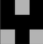
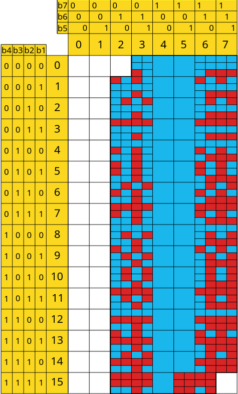

# ChessMinitel

Ardisson Noémie - Py Antonin - Boisset Valentin

## Manuel d'utilisation

Ce document décrit pas à pas l'installation, la compilation, le flash et l'utilisation du projet ChessMinitel. Il est destiné à tout utilisateur disposant d'un environnement Linux et d'une carte compatible RIOT-OS.

### 1. Clonage du dépôt

```
git clone [URL_DU_DEPOT]
cd chessminitel
git submodule update --init --progress
```
**Remarque :** les sous-modules sont indispensables au bon fonctionnement du projet (RIOT-OS et dépendances associées).

### 2. Outils et dépendances

#### 2.1 Installation de la chaîne de développement RIOT (ARM, Linux)

Installer les dépendances système nécessaires :

```
sudo apt install git gcc-arm-none-eabi make gcc-multilib \
                 libstdc++-arm-none-eabi-newlib openocd \
                 gdb-multiarch doxygen wget unzip python3-serial
```

#### 2.2 Installation d'une version récente d'OpenOCD

Certaines cartes nécessitent une version récente d'OpenOCD (≥ 0.12.0).

```
mkdir -p ~/sfnet/openocd
git clone https://git.code.sf.net/p/openocd/code ~/sfnet/openocd/code
cd ~/sfnet/openocd/code
git checkout v0.12.0
./bootstrap
./configure
make -j 4
sudo make install
openocd --version
```

### 3. Compilation

Se placer dans le dossier **chessminitel** du projet puis lancer :

```make -j 4 [JOUEUR=0123]```

L'option ```JOUEUR``` permet de définir quels joueurs sont associés à la carte courante.

* Les chiffres possibles sont ```0```, ```1```, ```2``` et ```3```.

* Toutes les combinaisons sont autorisées.

* Chaque joueur doit être déclaré une seule fois sur l'ensemble des cartes.

* Par défaut, les quatre joueurs sont regroupés sur un seul Minitel.

### 4. Flash 

1. Brancher la carte en USB.

2. Vérifier que l'utilisateur dispose des droits nécessaires (uDev, accès USB).

3. Lancer la commande suivante :

```make flash```

4. Une fois le flash terminé, bébrancher et rebrancher la carte (le reset peut mal se faire sur cetraines cartes). 

### 5. Utilisation

Les règles du jeu implémentées correspondent aux échecs à quatre joueurs : https://www.chess.com/fr/terms/les-echecs-a-quatre-joueurs

* Le programme communique avec un Minitel (ou un émulateur compatible) via l'interface série.

* L'utilisateur peut interagir avec le jeu d'échecs à l'aide du clavier du Minitel.

* Les coups sont saisis selon une notation simplifiée affichée à l'écran.

Les messages affichés guident l'utilisateur à chaque étape (sélection des coups, erreurs de saisie, état de la partie).

## Documentation du code

Les dossiers **boards** et **RIOT-OS** contiennent le code nécessaire à l'utilisation d'une carte RIOT-wyres (voir : https://github.com/CampusIoT/RIOT-wyres/ )

Le dossier chessminitel contient notre code. Voici un descriptif des classes et des fonctions principales :

### Structure générale du code

Le code est organisé de la manière suivante :

* Une fonction ```main```, point d'entrée du programme, qui gère la boucle principale et l'enchaînement des tours de jeu.

* Une classe ```Game```, responsable de l'état global du jeu et de la logique principale.

* Une classe abstraite ```Piece```, dont héritent toutes les pièces du jeu.

* Une classe ```Plateau```, chargée de la représentation et de la gestion du plateau.

* Des fonctions utilitaires pour la communication Minitel et LoRa.

### Descriptions des classses

#### Classe ```Piece```

**Attributs principaux :**

| Spécification | Description|
|---------------|------------|
|```Couple pos``` | Position de la pièce sur le plateau|
|```int appartenancePlayer``` | Joueur auquel appartient la pièce|
|```int points``` | Valeur de la pièce |

**Méthodes principales :**

| Spécification | Description|
|---------------|------------|
| ```void deplacer(Couple newPos)``` | Modifie la position courante de la pièce |
| ```CoupleList* availableMoves(Plateau* board)``` | Renvoie la liste des coups possibles (sans prise en compte des échecs) |
| ```void afficherMinitel()``` | Affiche la pièce sur le Minitel |

#### Classe ```Plateau```

**Attributs principaux :**

| Spécification | Description|
|---------------|------------|
| ```Piece* plateau[height][width]``` | Matrice de pointeurs vers les pièces |

**Méthodes principales :**

| Spécification | Description|
|---------------|------------|
| ```void afficherMinitel()``` | Affiche le plateau sur le Minitel |
| ```void deplacer(Couple pos1, Couple pos2)``` | Déplace une pièce uniquement sur le plateau |

#### Classe ```Game```

**Attributs principaux :**

| Spécification | Description|
|---------------|------------|
| ```Plateau* board``` | Pointeur vers le plateau |
| ```int points[4]``` | Points actuels des quatre joueurs |

**Méthodes principales :**

| Spécification | Description|
|---------------|------------|
| ```void start()``` | Initialise une partie |
| ```bool play(Couple from, Couple to, int currentPlayer)``` | Vérifie la validité d'un coup et l'exécute |
| ```bool isEchec(int player)``` | Indique si un joueur est en échec
| ```bool isEchecEtMat(int player)``` | Indique si un joueur est échec et mat
| ```bool isPat(int player)``` | Indique si un joueur est pat

### Communication LoRa

Les méthodes utiles pour le LoRa sont dans ```chessminitel/src/tools/LoRa.c```


| Spécification | Description|
|---------------|------------|
|  ```void initialize_lora(void)``` | Initialise le module LoRa (125 kHz, SF12, CR=5, fréquence 868 MHz)  |
| ```void send_lora_message(int coup_a_envoyer[4])``` | Envoie un coup : coordonnées de départ et d'arrivée |
| ```void listen_for_message(int coup_recu[4])``` | Attend et reçoit un coup depuis une autre carte (fonction bloquante)|

### Affichage sur Minitel

Gestion de l'affichage du plateau grace aux semi-caractères du minitel. Voici un glossaire des pièces :

Piece | Code semi-graphique pièce droite | Code semi graphique pièce coté| Rendu
------|---------------------|---------------------|-------
Pion  |      ```0x78 0x30```      | ```0x3D 0x20```| 
Tour  |      ```0xD7 0x35```      | ```0xF5 0x13``` | 
Cavalier | ```0x7A 0x31``` | ```0x3D 0x34``` | 
Fou | ```0x7E 0x30``` | ```0x3F 0x24``` | 
Dame | ```0x76 0x34``` | ```0x77 0x24``` | 
Roi | ```0x6D 0x25``` | ```0x6E 0x31``` |  


## Annexe

Table des caractères semi-graphique :

